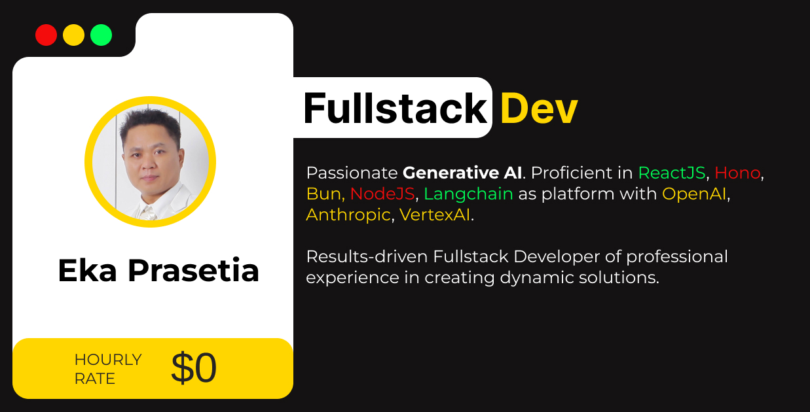

# AstroPaper 📄




[](https://conventionalcommits.org)
[](http://commitizen.github.io/cz-cli/)

## 🔥 Features

- [x] type-safe markdown
- [x] super fast performance
- [x] accessible (Keyboard/VoiceOver)
- [x] responsive (mobile ~ desktops)
- [x] SEO-friendly
- [x] light & dark mode
- [x] fuzzy search
- [x] draft posts & pagination
- [x] sitemap & rss feed
- [x] followed best practices
- [x] highly customizable
- [x] dynamic OG image generation for blog posts
- [x] code syntax highlighting
- [x] social media sharing

## ✅ Lighthouse Score

<p align="center">
  <a href="https://pagespeed.web.dev/report?url=https%3A%2F%2Fastro-paper.pages.dev%2F&form_factor=desktop">
    
  <a>
</p>

## 🚀 Project Structure

Inside of AstroPaper, you'll see the following folders and files:

```bash
/
├── public/
│   ├── assets/
│   │   └── logo.svg
│   │   └── logo.png
│   └── favicon.svg
│   └── astropaper-og.jpg
│   └── robots.txt
│   └── toggle-theme.js
├── src/
│   ├── assets/
│   │   └── socialIcons.ts
│   ├── components/
│   ├── content/
│   │   |  blog/
│   │   |    └── some-blog-posts.md
│   │   └── config.ts
│   ├── layouts/
│   └── pages/
│   └── styles/
│   └── utils/
│   └── config.ts
│   └── types.ts
└── package.json
```

## 📜 License

Licensed under the MIT License, Copyright © 2023
